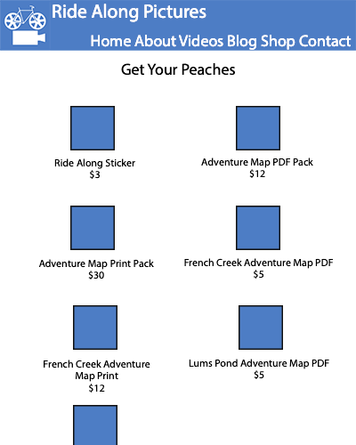

# Ride Along Pictures
## Business Website for Ride Along Pictures Ltd.

### This is just the front end visit [the backend here](https://github.com/travissouthard/ride-along-backend)

### About

Ride Along Pictures Ltd. is an LLC business founded by Kate Norris and Travis Southard. They are two best friends who create films and other media around outdoor adventures to help bring new people into that world and to advocate for where those adventures take place. In fall 2019, they rode the entire East Coast Greenway from Calais, ME to Key West, FL and filmed the trip to make a (still in post-production) documentary about their experiences on that trip. 

### Purpose
Ride Along Pictures Ltd. needs a website to showcase past and present work, connect with clients, and host their blog. RAPL had a website until April, when we let the subscription lapse as COVID restrictions fell into place. The website that we did have was built with Squarespace and while it served as a placeholder, I have been wanting to redo the site for months now.

### Features
- Home page with:
  - Most recent video
  - Most recent blog post
- About page with:
  - Company description and purpose statement
  - Kate bio
  - Travis bio
  - History of Ride Along
- Videos page with:
  - Carousel/Playlist of `<iFrame>` or `<video>` videos
    - I have questions about the `<video>` tage, especially around designing my own controls/feedback data
  - Anouncement/poster for our East Coast Greenway documentary
- Blog page with:
  - Posts, possibly with like/comment/share functionality
  - Index(previews) and show pages(full views)
  - Internal CMS with admin logins for Kate and me
- Trips page with:
  - Images, descriptions, and prices of available products
  - Show pages for each product
- Hire us/Contact page with:
  - Links to contact us and to see our projects
  - Press about us

### Build
- Front end:
  - React
  - React Router Dom
  - Stripe to take card payments
- Back end:
  - Python/Flask
  - SQL Server to maintain:
    - Blog & video data
    - Basic analytics feedback
    - Admin login

### Wish List
- Custom analytics
- Ability to directly upload image files
- Refactoring backend with node/express since python/flask seems a little slow
- Alternately, adding in placeholder blocks would also work for this

### User Stories
- As a viewer I want to:
  - watch their videos
  - read their blog posts
  - search through bogs and videos
  - sort videos and blogs by:
    - Date
    - Most-viewed
    - By trip (with tags)
  - Comment on blogs and videos
- As a client I want to:
  - Be able to contact them easily
  - Understand what they can offer me
  - be able to see their best work
- As an admin (biz owner) I want to:
  - Be able to easily add blogs and videos
  - Have exclusive control over content adding, deletion, comment moderating, etc.
  - know how often videos are played and blogs are read
    - By gross number and unique visitors

